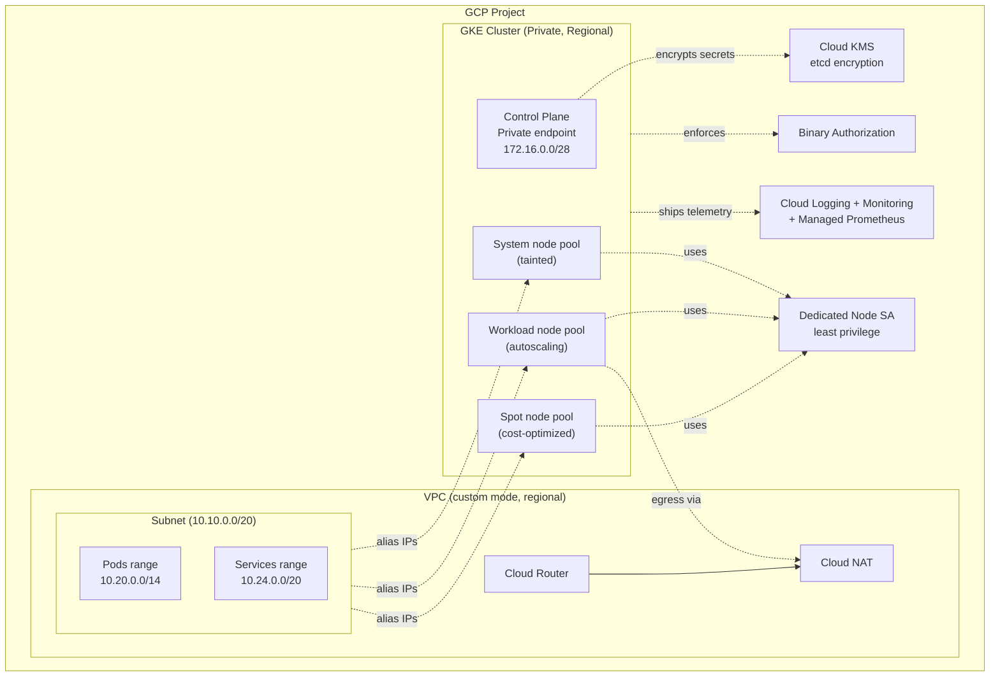

# Architecture

## High-Level Diagram

## Design Decisions

### Why Regional Clusters?
- HA control plane across 3 zones → no single-zone control plane outage
- Higher SLA (99.95% vs 99.5% zonal)
- Slight cost increase justified for production

### Why Dataplane V2?
- eBPF-based — better performance than iptables kube-proxy
- Built-in NetworkPolicy enforcement (no Calico add-on)
- Hubble-style observability
- Removes need for kube-proxy DaemonSet

### Why Dedicated Node SA?
- Default Compute SA has Editor on the project (security anti-pattern)
- Custom SA with only the 5 roles GKE actually needs
- Easier to audit and rotate

### Why Workload Identity?
- Pods can authenticate to GCP **without secret keys** mounted
- KSA → GSA binding via annotation
- Eliminates the entire class of "leaked SA key" incidents

### Why Multi-Pool Architecture?
- **System pool** (tainted) — guarantees control plane add-ons have capacity
- **Workload pool** — application workloads, scales aggressively
- **Spot pool** — batch / fault-tolerant workloads at 60-80% cost savings

### Why Per-Env Separate State?
- Blast radius isolation
- Different velocity (dev iterates faster than prod)
- Different security posture (BinAuthz off in dev for speed)

## Future Work

- [ ] Add `bigtable` / `spanner` companion modules
- [ ] Add Anthos Config Management bootstrap
- [ ] Add Multi-Cluster Ingress (MCI) example
- [ ] Add Backup for GKE configuration
